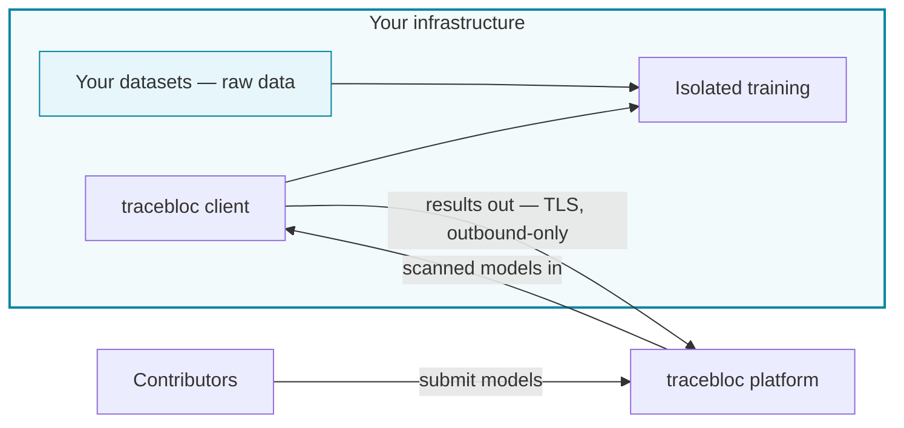

**Models come to your data — your data never leaves your infrastructure.** You run a tracebloc *client* on your own hardware. Contributors submit models that are scanned and run in isolation against your data, on your machines. Only results leave — and trained model weights only if you choose to share them.

## The trust boundary

Raw data stays inside your infrastructure. The client opens an **outbound-only** connection — nothing reaches in to pull your data out.

## How it works

<Steps>
  <Step title="Deploy your workspace">
    One command sets up your private workspace on your own infrastructure — a laptop, an on-prem server, or a cloud cluster.
  </Step>
  <Step title="Ingest your datasets">
    Stage your training and test data locally. Metadata syncs to the platform so contributors can see what's available — **the raw data never moves.**
  </Step>
  <Step title="Create a use case">
    Define a use case from your datasets and set how submitted models are evaluated.
  </Step>
  <Step title="Invite contributors">
    Whitelist contributors by email. Only the people you invite can take part.
  </Step>
  <Step title="Contributors submit and train models">
    Each model is **scanned for vulnerabilities**, then trains against your data in an **isolated container**, on your hardware.
  </Step>
  <Step title="Only results are shared">
    Training and evaluation results flow back to you over TLS. Trained model weights are shared **only if you choose to** — you control that in the admin panel.
  </Step>
</Steps>

## What stays, what leaves

| Data | Shared with the platform? |
|---|---|
| Raw training & test data | **Never** — it stays on your infrastructure |
| Dataset metadata (schema, row counts) | Yes — so contributors know what's available |
| Training & evaluation results | Yes — the metrics models are judged on |
| Trained model weights | **Only if you allow it** — your choice per collaboration, set in the admin panel |

Enforced by per-job container isolation, a NetworkPolicy that blocks data egress from training pods, a vulnerability scan before any model runs, and TLS on all traffic.

<Note>
**The mental model:** `1 machine = 1 client = 1 workspace = n datasets`. One deployment per machine; as many datasets inside it as you like.
</Note>

## Vocabulary

| Term | What it is |
|---|---|
| **Client** | Your private AI workspace — tracebloc's software running on your own infrastructure, where you invite contributors to train models on your data |
| **Workspace** | The everyday name for your client — your dedicated, private AI environment on one machine |
| **Dataset** | Data you've staged locally for use cases |
| **Use case** | A task contributors build models for, against your datasets |
| **Contributor** | An external data scientist who submits models — and never sees your raw data |

## What it touches

The installer changes only **Docker** and **`~/.tracebloc`** on your host — no system-wide changes. Uninstalling is a single command, and your data is yours throughout.

## Get started

<CardGroup cols={2}>
  <Card title="Quick Start" icon="rocket" href="/environment-setup/quickstart">
    A running workspace in about 10 minutes, with one command.
  </Card>
  <Card title="Deployment environments" icon="server" href="/environment-setup/setup-guide">
    Deploy on local / k3d, bare-metal, EKS, AKS, or OpenShift.
  </Card>
</CardGroup>

<Note>
Want the guarantees in detail for your security team? See [Security & data handling](/environment-setup/configuration#security).
</Note>
