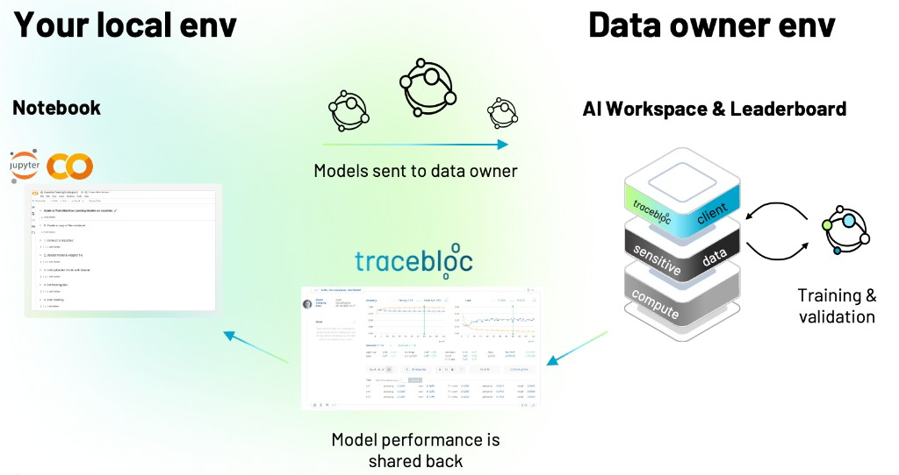

tracebloc is an AI workspace where you can train and evaluate models on datasets you never directly access. The data stays with the data owner, your code runs on their infrastructure, and a leaderboard ranks every submission side by side.

Here is how it works, step by step.

## 1. Explore use cases

A use case is a collaborative task built around a specific dataset. Each use case has a description, evaluation metrics, rules, and an exploratory data analysis (EDA) that tells you everything you need to know about the data without exposing it.

Browse active use cases to find one that matches your interest.

→ [Explore Use Cases](/join-use-case/explore-use-case)

## 2. Join

You can join a public use case directly or receive an invite link for a private one. When you join, you accept the rules and get assigned to a team. You can invite collaborators to your team at any time.

→ [Join a Use Case](/join-use-case/join-use-case)

## 3. Set up and train

You work from a Jupyter notebook on your local machine or Google Colab. The notebook connects to the tracebloc workspace, where you upload a model, link it to the dataset, configure hyperparameters, and start training. Your model code executes on the data owner's infrastructure. You never download or see the raw data.

→ [Start Training](/join-use-case/start-training)

## 4. Customize your model

You can use any architecture: PyTorch, TensorFlow, or sklearn. The easiest way to get started is the [tracebloc model zoo](https://github.com/tracebloc/model-zoo), a collection of starter templates you can modify freely. Pick a template, adjust it to your needs, and upload. The only requirement is that a few mandatory variables at the top of your model file match the use case parameters.

→ [Customize Models](/join-use-case/model-optimization)

## 5. Tune hyperparameters

Configure optimizers, learning rates, loss functions, callbacks, data augmentation, and LoRA parameters for LLM fine-tuning. All parameters are set through the notebook before or between training runs.

→ [Hyperparameters](/join-use-case/hyperparameters)

## 6. Evaluate and submit

Once training is complete, you select your best performing cycle and submit it for evaluation on the test dataset. Your score appears on the leaderboard, ranked against all other teams. Submissions are limited daily to prevent overfitting.

→ [Evaluate Model](/join-use-case/model-evaluation)

---

## Need help?

- Email us at [support@tracebloc.io](mailto:support@tracebloc.io)
